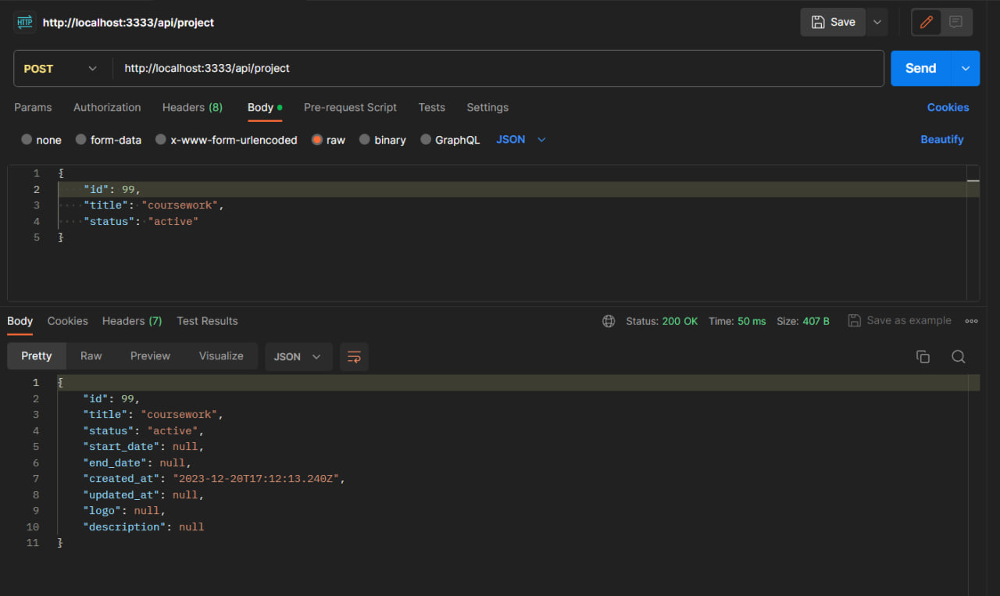
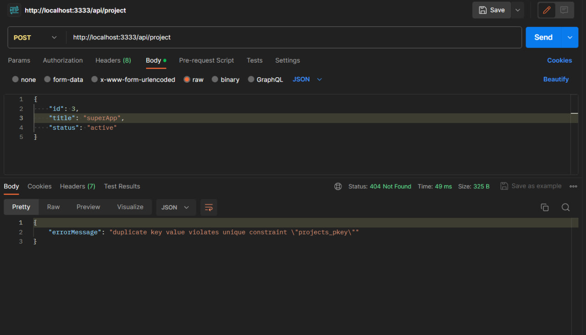
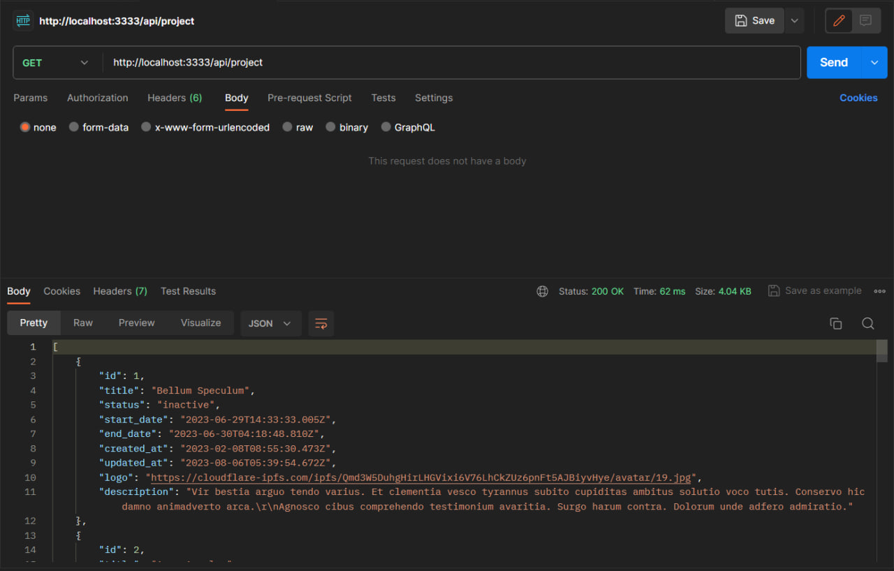
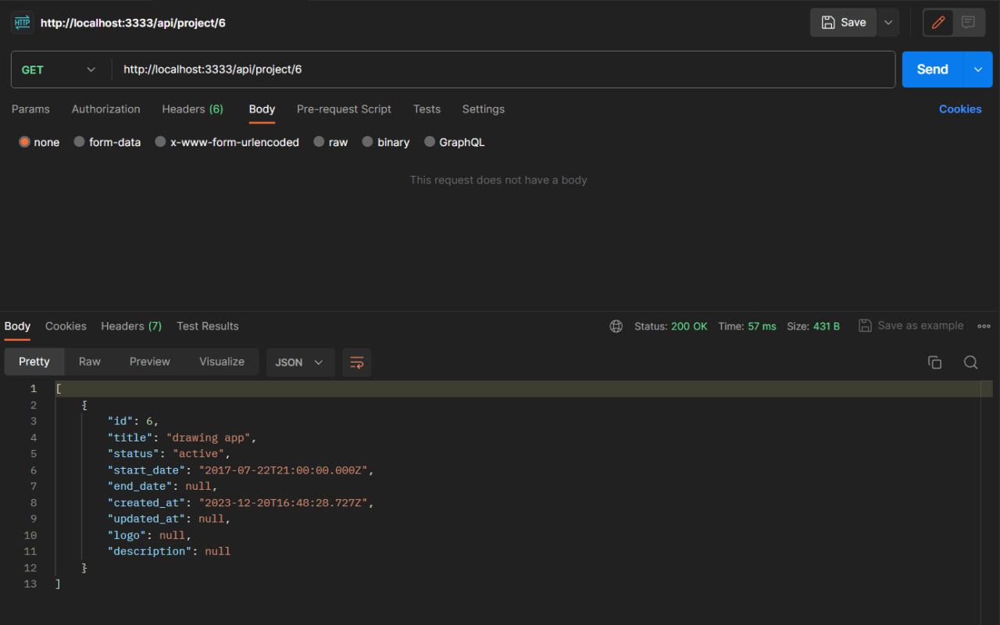
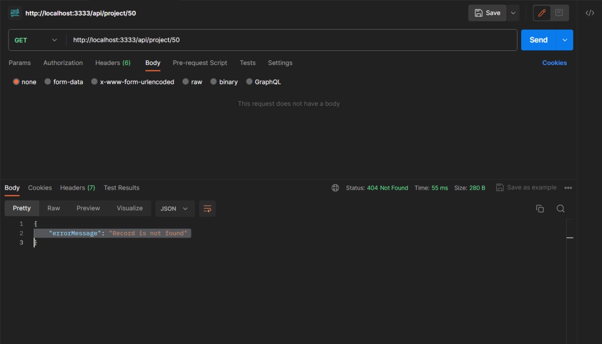
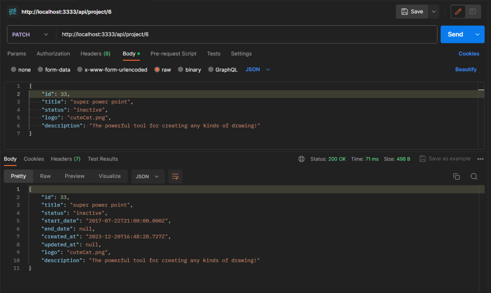
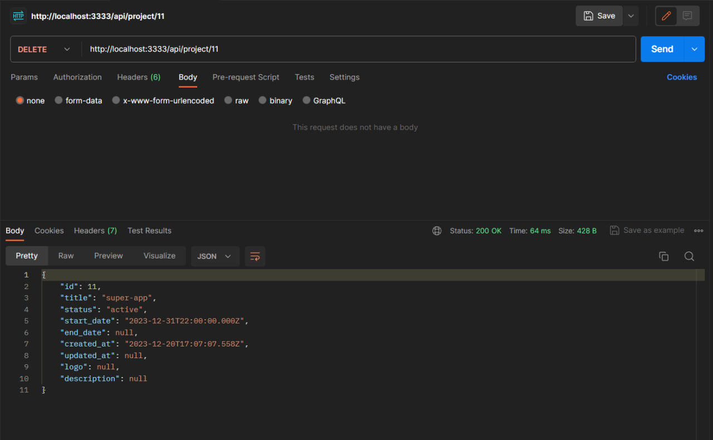
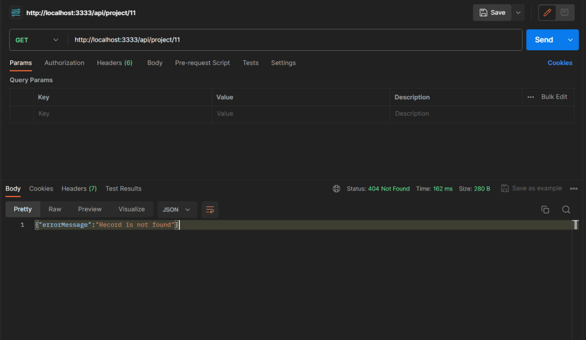
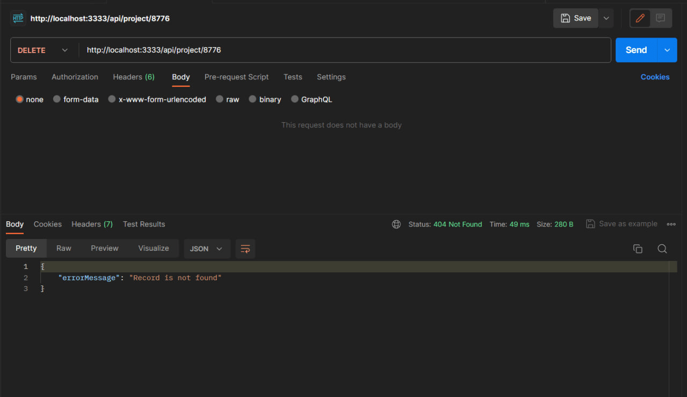

# Тестування працездатності системи

## Post

### Створення нового проєкту

### Спроба створити проєкт із неунікальними id або title

## Get

### Одержання всіх записів таблиці

### Одержання запису за його id

### Спроба одержати запис, якого не існує

## Patch

### Зміна деяких властивостей запису

## Delete

### Видалення запису з таблиці

### Спроба видали запис, якого не існує

